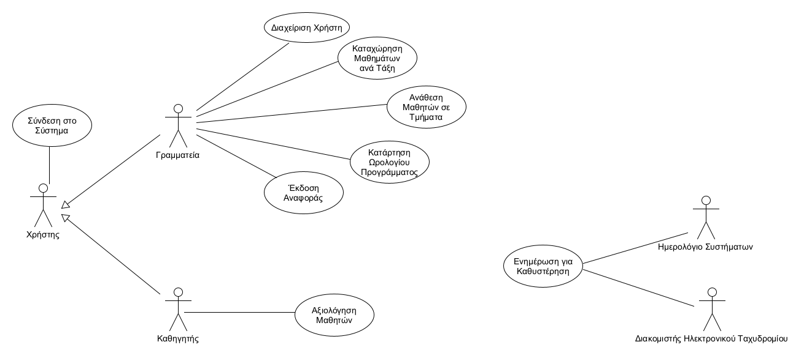
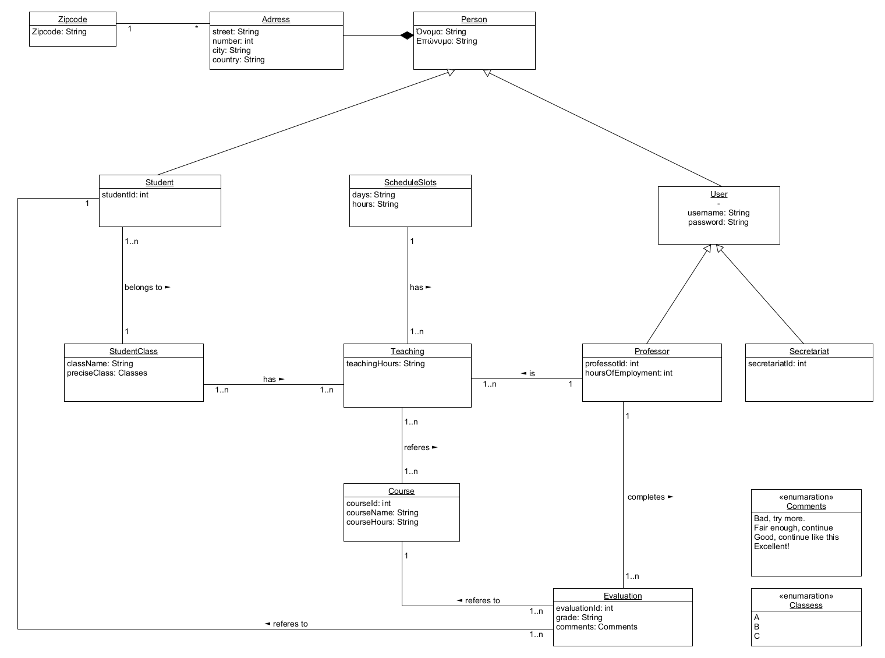

\[*Παρακάτω δίνεται μία περιγραφή του περιεχομένων του Εγγράφου Προδιαγραφών Απαιτήσεων Λογισμικού (ΕΠΑΛ) που βασίζεται σε πρότυπο περιπτώσεων χρήσης. Για κάθε ενότητα του εγγράφου γίνεται παραπομπή σε παραδείγματα του βιβλίου “Μ Γιακουμάκης, Ν. Διαμαντίδης, Τεχνολογία Λογισμικού, Σταμούλης, 2009”. Το παράδειγμα ενός συστήματος Τράπεζας έχει σχεδιαστεί από τον Β.Ζαφείρη στα πλαίσια φροντιστηρίων του μαθήματος Τεχνολογία Λογισμικού του Τμήματος Πληροφορικής του ΟΠΑ.*\]

# Εισαγωγή

Tο παρόν σύστημα υποστηρίζει μια σχολική μονάδα μέσης εκπαίδευσης (γυμνάσιο). 
Αναλυτικότερα, παρέχεται η δυνατότητα επεξεργασίας Μαθητών-Καθηγητών καθώς και η δυνατότητα καταχώρησης μαθητών σε τάξεις και τμήματα. 
Η μέγιστη χωρητικότητα των αιθουσών, λόγω των μέτρων της πανδημίας, ορίζεται σε 15 άτομα, οπότε και το κάθε τμήμα θα έχει μέγιστη χωρητικότητα τα 15 άτομα.
Όταν μια αίθουσα φτάσει στο μέγιστο αριθμό μαθητών, οι υπόλοιποι μαθητές τοποθετούνται στην επόμενη αίθουσα εφόσον υπάρχει διαθέσιμη. 
Ειδικότερα, η Γραμματεία έχει τη δυνατότητα καταχώρισης των μαθημάτων για κάθε τάξη (1η, 2α, 3η γυμνασίου) και το σύστημα θα υποστηρίζει 
συγκεκριμένες ειδικότητες Καθηγητών όπως στα Μαθηματικά, τα Φιλολογικά, τις Φυσικές Επιστήμες, τη Φυσική Αγωγή και τα Καλλιτεχνικά.
Το σημαντικότερο σημείο του λογισμικού αφορά την υποστήριξη-ανάθεση μαθημάτων διδασκαλίας ανά Καθηγητή, εξασφαλίζοντας την συμβατότητα μεταξύ του είδους του μαθήματος και της ειδικότητας του Καθηγητή καθώς και το μέγιστο επιτρεπτό ωράριο του κάθε διδάσκοντως (20 ώρες).
Επιπλέον, θα υποστηρίζεται η καταχώριση βαθμολογίας και ο σχολιασμός της πορείας, σε κάθε μαθητή για κάθε μάθημα από τον αντίστοιχο διδάσκοντα του. 
Τέλος, θα εκδίδονται αναφορές αξιολόγισης με τη συνολική, τελική, βαθμολογία κάθε μαθητή.
 
## Εμβέλεια

Το σύστημα θα παρέχει λειτουργικότητα για:
* Την εγγραφή νέων μαθητών και Καθηγητών στη σχολική μονάδα.
* Την δημιουργία τμήματων. 
* Την έκδοση του συνολικού ωρολογίου προγράμματος της σχολικής μονάδας. 
* Την ενημέρωση της Γραμματείας με κατάλληλο μήνυμα όταν δεν μπορεί να επιτευχθεί η έκδοση αναφοράς αξιολόγησης. 
* Την ενημέρωση του Καθηγητή με κατάλληλο μήνυμα όταν δεν έχει καταχωρηθεί η βαθμολογία ή η περιγραφή της πορείας μάθησης ενός μαθητή.

Το σύστημα δεν θα παρέχει τη λειτουργικότητα για:
* την ενημέρωση/διόρθωση του ωρολογίου προγράμματος. 
* την σύνδεση μαθητών στο σύστημα για την έκδοση της αναφοράς αξιολόγησής τους. 
* την κατάταξη μαθητών σε τμήματα ανάλογα με την απόδοσή τους σε προηγούμενες χρονιές (μαθητές που δεν προβιβάστηκαν την περσινή 
χρόνιά θα προβιβαστούν τάξη σύμφωνα με το σύστημα καθώς το σύστημα τους καταχωρεί σε τάξεις με βάση την ηλικία τους).

## Ορισμοί Ακρώνυμα και Συντομογραφίες

| Ακρωνύμια | Συντομογραφία |
| :----------------------| :---------|
| Περίπτωση Χρήσης | ΠΧ
| Επιχειρησιακοί Κανόνονες | ΕΚ

## Αναφορές

Δεν υπάρχουν αναφορές σε άλλα έγγραφα (μελέτη σκοπιμότητας, ΕΠΑΣ, επιχειρησιακά μοντέλα κλπ).

## Επισκόπηση

* Στο έγγραφο παρουσιάζεται μια επισκόπηση του μοντέλου περιπτώσεων χρήστης καθως και οι Λειτουργικές και Μη-Λειτουργικές απαιτήσεις του συστήματος. 
Ακολουθούν πίνακες με αναλυτική περιγραφή των actors του συστήματος, των περιπτώσεων χρήσης, των ενδιαφερωμένων και 
των ειδικών αναγκών τους καθώς και οι στόχοι των actors. Επιπροσθέτως, παρουσάζονται οι περιορισμοί στη σχεδίαση και την υλοποίηση του 
συστήματος της σχολικής μονάδας και τέλος τα ποιοτικά χαρακτηριστικά του λογισμικού. 

# Συνολική Περιγραφή

## Επισκόπηση Μοντέλου Περιπτώσεων Χρήσης

Διάγραμμα Περιπτώσεων Χρήσης: 

| ΠΕΡΙΠΤΩΣΗ ΧΡΗΣΗΣ 	 | ΠΕΡΙΓΡΑΦΗ |
| :----------------------| :---------|
| ΠΧ1. Επεξεργασία Χρήστη | Η περίπτωση χρήσης για την επεξεργασία των στοιχείων των χρηστών.
| ΠΧ2. Καταχώρηση Μαθημάτων ανά Τάξη | Η περίπτωση χρήσης για την καταχώρηση των μαθητών του σχολείου στις τάξεις.
| ΠΧ3. Καταχώρηση Μαθητών σε Τμήματα	 | Η περίπτωση χρήσης για την καταχώρηση των εγγεγραμμένων μαθητών .
| ΠΧ4. Δημιουργία Ωρολογίου Προγράμματος | Η περίπτωση χρήσης για την δημιουργία του ωρολογίου προγράμματος.
| ΠΧ5. Έκδοση Αναφοράς | Η περίπτωση χρήσης με την οποία εκδίδεται η αναφορά με την συνολική βαθμολόγια του κάθε μαθητή.
| ΠΧ6. Σύνδεση στο Σύστημα | Η περίπτωση χρήσης με την οποία η Γραμματεία και ο Καθηγητής αποκτούν πρόσβαση στο σύστημα.
| ΠΧ7. Αξιολόγηση Μαθητών	| Η περίπτωση χρήσης στην οποία ο Καθηγητής εκχωρεί τη βαθμολογία και σχόλια για την πορεία κάθε μαθητή με βάση την συμμετοχή του στο μάθημα που διδάσκει. 

## Υποθέσεις και Εξαρτήσεις

* Το λογισμικό εξαρτάται από πλήθως εξωτερικών βιβλιοθηκών. 
* Το σύστημα θα είναι εγκατεστημένο στο γραφείο της Γραμματείας της σχολικής μονάδας. 
* Η πρόσβαση στο σύστημα θα πραγματοποιείται από μία μοναδική θέση (το γραφείο της Γραμματείας του σχολείου).
* Δεν υπάρχουν περιβαντολλογικοί περιορισμοί (ενέργειας,θερμοκρασίας, υγρασίας και ηλεκτρομαγνητικών παρεμβολών).
* Το σύστημά μας, δεν εξαρτάται από άλλα συστήματα, καθώς δεν υπάρχει εσωτερική ή εξωτερική επικοινωνία με άλλα συστήματα.

# Ειδικές Απαιτήσεις 

# Λειτουργικές Απαιτήσεις

* Το σύστημα θα πρέπει να παρέχει στη Γραμματεία δυνατότητα εγγραφής νέου χρήστη.
* Ο χρήστης του συστήματος πρέπει να έχει τη δυνατότητα να πραγματοποιεί αναζήτηση στη βάση δεδομένων.
* Σε κάθε εγγραφή θα πρέπει να αποδίδεται κατάλληλο αναγνωριστικό id σε κάθε εγγεγραμμένο χρήστη.
* Το σύστημα θα πρέπει να παρέχει κατά την σύνδεση, τη δυνατότητα ταυτοποίησης και δικαιοδοσίας στους καθηγητές.
* Η Γραμματεία θα πρέπει να καταχωρεί τα μαθήματα που αντιστοιχούν σε κάθε τάξη .
* Το σύστημα θα πρέπει να ελέγχει τον αριθμό μαθητών ανά τμήμα ώστε ο μέγιστος αριθμός να μην ξεπερνά τους 15 μαθητές.
* Η Γραμματεία θα πρέπει να έχει την δυνατότητα ανάθεσης Καθηγητών σε τμήματα.
* Η Γραμματεία θα πρέπει να έχει τη δυνατότητα να ελέγχει την διαθεσιμότητα Καθηγητών για ανάθεση ωρών διδασκαλίας μαθημάτων ώστε κάθε Καθηγητής να επιβαρύνεται το πολύ με 20 ώρες διδασκαλίας.
* Το σύστημα θα πρέπει να δίνει τη δυνατότητα στους Καθηγητές να εκχωρούν τις αξιολογήσεις τους σε αρχεία για κάθε μαθητή. 
* Το σύστημα θα πρέπει να εκδίδει αναλυτική αναφορά βαθμολογίας, σύμφωνα με τις καταχωρήσεις των Καθηγητών,  για κάθε μαθητή.

# Μη Λειτουργικές  Απαιτήσεις 

* Να εξασφαλίζεται η ακεραιότητα των πληροφοριών κατά την επικοινωνία με την Βάση Δεδομένων.
* Να υπάρχει εύλογη χρονική ανταπόκριση κατά τις δοσοληψίες (data base transactions) αυτές.
* Το σύστημα να κρατάει σωστό και ορθό ημερολόγιο για να ακολουθείται μια σωστή αλληλουχία δοσοληψιών.
* Ως προς την χρήση του email server, αυτό να είναι πάντα σε σύνδεση με το σύστημα και χωρίς να χάνει τις πληροφορίες του.
* Ο αποθηκευτικός χώρος του σύστηματος να είναι επαρκής και πάντα ενημερωμένος με σωστά backups.
* Να μην γίνονται έκθεση δεδομένων των χρηστών ή των αποθηκευμένων πληροφοριων που είναι στο σύστημα σε μη εξουσιοδοτημένους χρήστες του συστήματος.
* Εύκολο στην συντηρησιμότητα του το σύστημα/λογισμικό.

## Περιπτώσεις χρήσης

### Οι Ενδιαφερόμενοι και οι Ανάγκες τους

Ένας πίνακας των ενδιαφερομένων (stakeholders) με τις ανάγκες τους:	

| ΕΝΔΙΑΦΕΡΟΜΕΝΟΣ | ΑΝΑΓΚΕΣ |
| :----------------------| :---------|
| Γραμματεία  | 1. Να εκτελεί την επεξεγασία των χρηστών(εγγραφή / διαγραφή χρήστη και ενημέρωση τοιχείων χρήστη).   2. Να καταχωρεί τα μαθήματα στις αντίστοιχες τάξεις του Γυμνασίου (Α, Β & Γ).   3. Να αναθέτει τους μαθητές του Γυμνασίου στα αντίστοιχα τμήματα.   4. Να δημιουργεί το συνολικό ωρολόγιο πρόγραμμα του Γυμνασίου.   5. Να εκδίδει την αναφορά με την τελική βαθμολογία και τα τυχόν σχόλια του Καθηγητή για τον κάθε μαθητή του Γυμνασίου.
| Καθηγητής  | 1. Να συνδέεται στο σύστημα.   2. Να έχει πρόσβαση στα στοιχεία των μαθητών οι οποίοι παρακολουθούν το μάθημά του.   3. Να μπορεί να εισάγει την βαθμολογία του κάθε μαθητή και σχόλια για την επίδοσή του.

### Actors του Συστήματος

Ένας πίνακας με του actors του συστήματος:

| Actor | Περιγραφή | Στόχοι | Ενδιαφερόμενοι |
| :----------------------| :---------| :--------- | :--------- |
| Χρήστης		| Eίναι οποισδήποτε δικαιούται να συνδεθεί στο σύστημα. | Σύνδεση στο σύστημα   | Γραμματεία, Καθηγητής 
| Γραμματεία    | Είναι υπεύθυνη για την διάχειριση των χρηστών, των μαθημάτων,των τμημάτων και την δημιουργία του ωρολογίου προγράμματος. | Επεξεργασία Χρήστη, Καταχώρηση Μαθημάτων ανά Τάξη, Καταχώρηση Μαθητών σε Τμήματα, Δημιουργία Ωρολογίου Προγράμματος, Έκδοση Αναφοράς | Γραμματεία 
| Καθηγητής     | Είναι υπεύθυνος για την αξιολόγηση των μαθητών (εισαγωγή βαθμολογίας και σύντομων σχολίων). | Αξιολόγηση Μαθητών | Καθηγητής  
| Ημερολόγιο Συστήματος | Παρέχει πληροφορίες τρέχουσας ημερομηνίας και ώρας. Χρησιμοποιείται ως δευτερεύων actor για την ενημέρωση των καθυστερήσεων. 
| Διακομιστής Ηλεκτρονικού Ταχυδρομείου | Παρέχει δυνατότητα αποστολής μηνυμάτων ηλεκτρονικού ταχυδρομείου. 
| Διαχειριστής Συστήματος | Αναλαμβάνει την διαχείριση των χρηστών και την απόδοση δικαιωμάτων πρόσβασης στο λογισμικό. Διαχειριστής συστήματος μπορεί να είναι κάποιος από το προσωπικό της Γραμματείας. | Διαχείρηση χρηστών 

### Περιγραφές Περιπτώσεων Χρήσης

Σύνδεσμοι κατευθυντήριοι προς την αναλυτική περιγραφή των Use Cases: 

#### [ΠΧ1 Επεξεργασία Στοιχείων](uc1-user-edit.md)

#### [ΠΧ2 Καταχώρηση Μαθημάτων ανά Τάξη](uc2-course-register.md)

#### [ΠΧ3 Καταχώρηση Μαθητών σε Τμήματα](uc3-student-class-registration.md)

#### [ΠΧ4 Κατάρτηση Ωρολογίου Προγράμματος](uc4-Creating-curriculum-program.md)

#### [ΠΧ5 Έκδοση Αναφοράς](uc5-publish-of-report.md)

#### [ΠΧ6 Σύνδεση στο Σύστημα](uc6-login-to-system.md)

#### [ΠΧ7 Αξιολόγηση Μαθητή](uc7-evaluation-of-students.md)

## Συμπληρωματικές Προδιαγραφές

Οι επόμενες ενότητες περιέχουν όλες τις μη λειτουργικές απαιτήσεις και τους περιορισμούς σχεδίασης και υλοποίησης.

### Απαιτήσεις Διεπαφών

#### Διεπαφές Χρήστη

* Στο δικό μας λογισμικό δεν υπάρχουν διεπαφές χρήστη. 

#### Διεπαφές Υλικού

* Στο δικό μας λογισμικό δεν υπάρχουν διεπαφές υλικού. 

#### Διεπαφές Επικοινωνίας

* Το σύστημα θα στέλνει ενημερωτικά ηλεκτρονικά μηνύματα για τις περιπτώσεις που ο Καθηγητής δεν έχει εισάγει στο σύστημα 
βαθμολογία ή/και περιγραφή για την αξιολόγηση ενός μαθητή. 

#### Διεπαφές Λογισμικού

* Για την αποστολή των ηλεκτρονικών μηνυμάτων το σύστημα θα επικοινωνεί με τον διακομιστή ηλεκτρονικού ταχυδρομείου του Γυμνασίου.

### Περιορισμοί Σχεδίασης και Υλοποίησης

* Βάσεις Δεδομένων: Το σύστημα θα πρέπει να υποστηρίζει τα σχεσιακά συστήματα διαχείρησης βάσεων δεδομένων h2. 
* Java: Το σύστημα θα αναπτυχθεί σε Java. Το σύστημα μπορεί να εκτελείται σε εικονικές μηχανές της Java.

### Ποιοτικά Χαρακτηριστικά

#### Απόδοση

* Το σύστημα θα πρέπει να υποστηρίζει όσους μαθητές θα είναι εγγεγραμμένοι στη σχολική μονάδα, 
τους διαθέσιμους εκπαιδευτικούς καθώς και το δυναμικό της γραμματειακής υποστήριξης.

#### Διαθεσιμότητα

* Το σύστημα θα είναι διαθέσιμο τις εργάσιμες μέρες και ώρες. 

#### Ασφάλεια

* Όλες οι λειτουργίες θα πραγματοποιούνται μετά από διαδικασία αυθεντικοποίησης και ταυτοποιήσης χρήστη (λειτουργίες Γραμματείας 
και λειτουργίες Καθηγητή). 

#### Ευελιξία

Δεν έχουμε ειδικές απαιτήσεις ευελιξίας. 

#### Ευχρηστία

* Ο χρήστης θα πρέπει να είναι σε θέση να μπορεί να χρησιμοποιεί το σύστημα μετά από το πολύ 3 μέρες εκπαίδευσης. 

# Υποστηρικτικό Υλικό

## Μοντέλο Πεδίου

Tο μοντέλο πεδίου του συστήματος:

## Ανάλυση Περιπτώσεων Χρήσης
---------------------------------------

### Κλάσεις Ανάλυσης
Δεν ζητούνται κλάσεις ανάλυσης.

### Συμπεριφορές

Δεν είναι ζητούμενο το διάγραμμα κλάσεων με τις κλάσεις που συμμετέχουν στη συμπεριφορά του συστήματος για την περίπτωση χρήσης ούτε και διάγραμμα επικοινωνίας ή ακολουθίας που δείχνει την ανταλλαγή μηνυμάτων.

## Άλλα Μοντέλα
-------------------------------
Δεν ζητούνται άλλα μοντέλα όπως για παράδειγμα διαγράμματα μηχανής καταστάσεων, πίνακες απόφασης κλπ.

## Επιχειρησιακοί κανόνες

Πίνακας με του επιχειρησιακούς κανόνες:

| Επιχειρησιακοί κανόνες | Περιγραφή |
| :----------------------| :---------|
| ΕΚ1 | O Αριθμός Δελτίου Ταυτότητας,το ΑΦΜ και το id είναι μοναδικά για κάθε χρήστη. 
| ΕΚ2 | Όλα τα στοιχεία του χρήστη είναι υποχρεωτικά, με εξαίρεση το email.